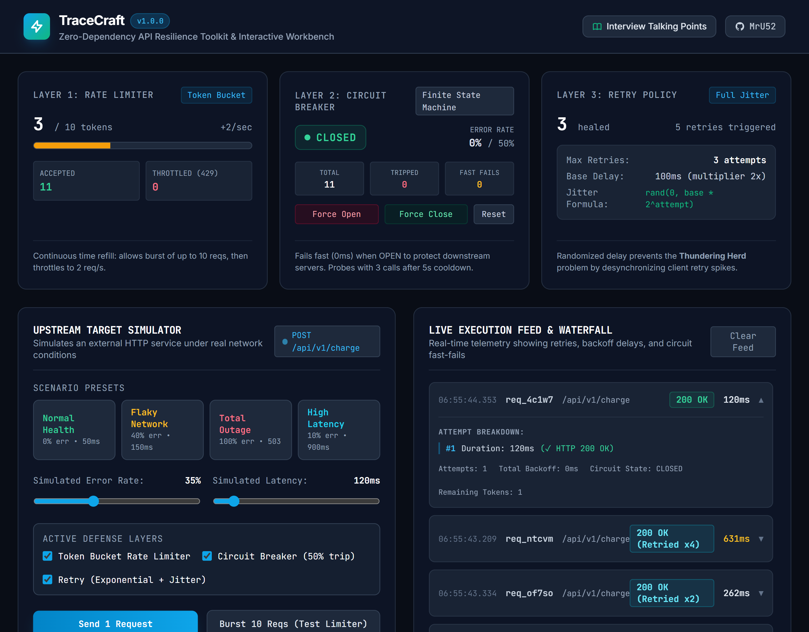

# TraceCraft

TraceCraft is a zero-dependency TypeScript toolkit and interactive workbench implementing core network resilience patterns: Token Bucket rate limiting, Finite State Machine circuit breaking, and Exponential Backoff retries with full jitter.

[](https://github.com/MrU52/tracecraft/actions)
[](https://www.typescriptlang.org/)
[](https://vitest.dev/)
[](LICENSE)



## Core mechanics

TraceCraft isolates outbound network calls across three composable resilience layers:

1. **Token Bucket Rate Limiter (`src/core/resilience/rate-limiter.ts`)**:
   - Enforces traffic quotas using continuous-time token refills: $T = \min(\text{capacity}, T + \Delta t \times \text{refillRate})$.
   - Allows configurable burst capacity while preventing client-side API quota exhaustion.
   - Rejects excess calls immediately with an explicit rate limit exception (HTTP 429).

2. **Finite State Machine Circuit Breaker (`src/core/resilience/circuit-breaker.ts`)**:
   - Implements Martin Fowler's three-state machine: `CLOSED`, `OPEN`, and `HALF_OPEN`.
   - Tracks call outcomes inside a rolling sliding window (default 6 calls).
   - Trips to `OPEN` when the error rate exceeds threshold (default 50%), failing subsequent calls in 0 ms without touching the network.
   - Transitions to `HALF_OPEN` after a cooldown period (default 5 seconds), routing trial probes to test downstream recovery before closing.

3. **Exponential Backoff with Full Jitter (`src/core/resilience/retry.ts`)**:
   - Retries transient errors (e.g. HTTP 503/504) while failing fast on permanent errors (e.g. HTTP 400).
   - Calculates delay using AWS Full Jitter: $\text{delay} = \text{random}(0, \min(\text{maxDelay}, \text{baseDelay} \times 2^{\text{attempt}}))$.
   - Eliminates the *thundering herd* problem by desynchronizing concurrent retry spikes across clients.

4. **ResiliencePipeline (`src/core/resilience/pipeline.ts`)**:
   - Chains Rate Limiter, Circuit Breaker, and Retry into a single execution wrapper with fallback routing and millisecond telemetry.

## System architecture

```text
┌─────────────────────────────────────────────────────────────────────────────┐
│ CLIENT INGRESS                                                              │
│                                                                             │
│  [Outbound Call] ──► [ResiliencePipeline]                                   │
└───────────────────────────────┬─────────────────────────────────────────────┘
                                │
                                ▼
┌─────────────────────────────────────────────────────────────────────────────┐
│ LAYER 1: RATE LIMITER (Token Bucket)                                        │
│ • tryAcquire(tokensRequested = 1)                                           │
│ • Refills continuously: T = min(cap, T + dt * rate)                         │
│ • If bucket empty ──► Reject immediately (HTTP 429)                         │
└───────────────────────────────┬─────────────────────────────────────────────┘
                                │ (Token Acquired)
                                ▼
┌─────────────────────────────────────────────────────────────────────────────┐
│ LAYER 2: CIRCUIT BREAKER (Finite State Machine)                             │
│ • If state == OPEN ──► Fast-fail in 0ms / Invoke Fallback (HTTP 503)        │
│ • If state == HALF_OPEN ──► Allow trial probe call                          │
│ • If state == CLOSED ──► Pass request to retry layer                        │
└───────────────────────────────┬─────────────────────────────────────────────┘
                                │ (Circuit Closed / Probing)
                                ▼
┌─────────────────────────────────────────────────────────────────────────────┐
│ LAYER 3: RETRY EXECUTOR (Exponential Backoff + Full Jitter)                 │
│ • Attempt 1: Execute primary network operation                              │
│ • On transient error: sleep( rand(0, base * 2^attempt) )                    │
│ • Attempt 2..N: Retry until success or max retries exhausted                │
└───────────────────────────────┬─────────────────────────────────────────────┘
                                │
                                ▼
┌─────────────────────────────────────────────────────────────────────────────┐
│ UPSTREAM SERVICE / DATABASE                                                 │
│ • Returns HTTP 200 OK or failure status                                     │
│ • Outcome feeds back to update Circuit Breaker sliding window metrics       │
└─────────────────────────────────────────────────────────────────────────────┘
```

## Quickstart

### Local setup

```bash
git clone https://github.com/MrU52/tracecraft.git
cd tracecraft
npm install
npm run dev
```

Open `http://localhost:5173` to launch the interactive testing workbench.

### Running tests

```bash
npm run test
```

17 unit tests verify:
- Rate limiter burst consumption and continuous time-delta refills.
- Circuit breaker state machine transitions (`CLOSED` -> `OPEN` -> `HALF_OPEN` -> `CLOSED`), sliding window error rates, and fast-fail fallbacks.
- Exponential backoff calculations with deterministic delay bounds and randomized jitter.
- Pipeline execution paths, error propagation, and telemetry recording.

### Production build

```bash
npm run build
npm run preview
```

## Code usage

### Unified ResiliencePipeline

```typescript
import {
  ResiliencePipeline,
  CircuitBreaker,
  TokenBucketRateLimiter,
  JitterStrategy,
} from 'tracecraft';

const pipeline = new ResiliencePipeline({
  name: 'payment-gateway',
  rateLimiter: new TokenBucketRateLimiter({
    capacity: 10,
    refillRatePerSec: 2,
  }),
  circuitBreaker: new CircuitBreaker({
    name: 'stripe-api',
    slidingWindowSize: 6,
    failureRateThreshold: 50,
    waitDurationInOpenStateMs: 5000,
  }),
  retryPolicy: {
    maxRetries: 3,
    baseDelayMs: 100,
    maxDelayMs: 1500,
    jitter: JitterStrategy.FULL,
  },
});

const outcome = await pipeline.execute(
  async () => {
    const res = await fetch('https://api.stripe.com/v1/charges', { method: 'POST' });
    if (!res.ok) throw new Error(`HTTP ${res.status}`);
    return await res.json();
  },
  // Graceful fallback when downstream is unavailable
  (error) => ({ status: 'queued_offline', reason: error.message })
);

console.log(outcome.status);          // 'SUCCESS' | 'RETRIED' | 'CIRCUIT_OPEN' | 'RATE_LIMITED'
console.log(outcome.totalDurationMs); // Total latency including backoff delays
```

### Standalone Circuit Breaker

```typescript
import { CircuitBreaker, CircuitState } from 'tracecraft';

const breaker = new CircuitBreaker({
  name: 'database-pool',
  slidingWindowSize: 10,
  failureRateThreshold: 50,
  waitDurationInOpenStateMs: 5000,
});

breaker.onStateChange((from, to, name) => {
  console.log(`Circuit [${name}] shifted from ${from} to ${to}`);
});

const user = await breaker.execute(
  () => db.query('SELECT * FROM users WHERE id = $1', [userId]),
  () => ({ id: userId, cached: true }) // Fast fallback
);
```

## Repository structure

```text
tracecraft/
├── .github/workflows/ci.yml       # GitHub Actions CI matrix (Node 20 & 22)
├── docs/
│   ├── assets/                    # Workbench and architecture screenshots
│   └── ARCHITECTURE.md            # In-depth architectural trade-offs
├── src/
│   ├── core/
│   │   └── resilience/            # Circuit breaker, rate limiter, retry, pipeline
│   ├── components/                # React workbench components
│   ├── test/                      # Vitest test suites (26 tests)
│   ├── App.tsx                    # Main workbench application
│   └── main.tsx                   # React root entry point
├── package.json
└── tsconfig.json
```

## License

MIT
