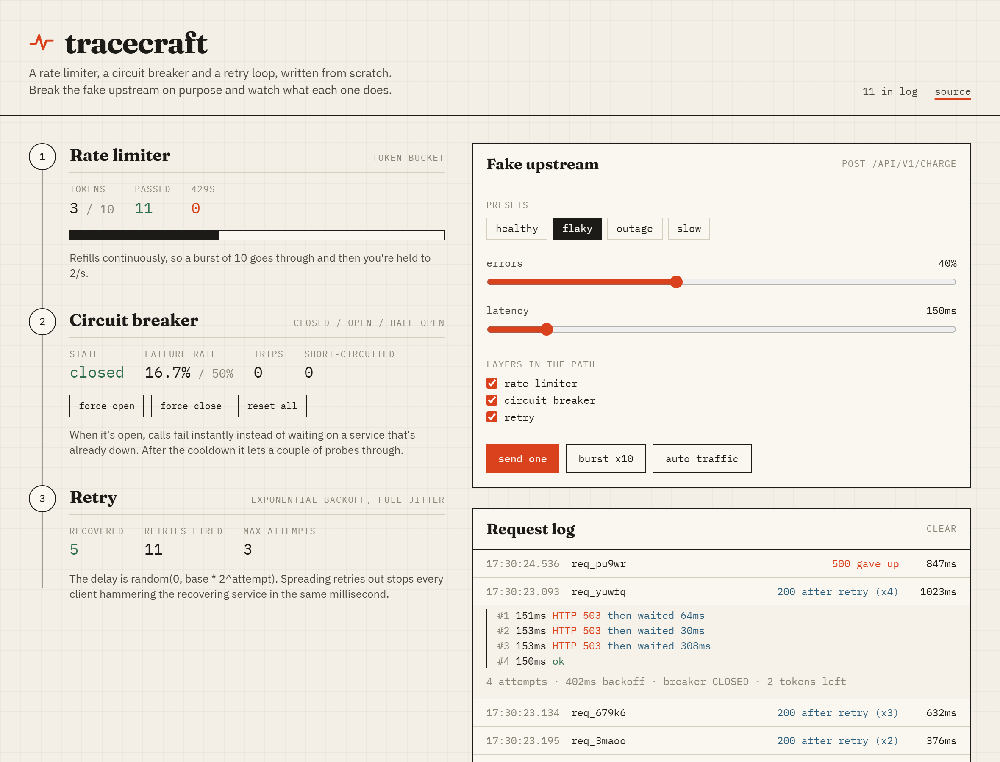

# tracecraft

A rate limiter, a circuit breaker and a retry loop, written from scratch in TypeScript, plus a small web page where you can break a fake upstream service and watch each one react.

I built it to understand how these three things actually behave when they're stacked on top of each other, instead of just importing a library.



## What's in `src/core/resilience`

- **`rate-limiter.ts`**: token bucket. Tokens are refilled lazily from the elapsed time, so there's no timer. A full bucket allows a burst, and after that you're held to the refill rate.
- **`circuit-breaker.ts`**: closed / open / half-open. A count-based sliding window decides when to trip (default: 50% failures over the last 10 calls, once there are at least 3 samples). After a wait it lets a few probe calls through and either closes again or goes straight back to open.
- **`retry.ts`**: exponential backoff with `none`, `full`, `equal` or `decorrelated` jitter. You can pass a `retryableErrors` predicate so 4xx errors don't get retried.
- **`pipeline.ts`**: wires them together in that order: limiter first, then breaker, then retries inside the breaker. It returns an outcome object (status, attempts, per-attempt log, backoff time) instead of throwing, and takes an optional fallback.

One thing worth knowing: a pipeline call counts as **one** outcome for the breaker, no matter how many retries happened inside it.

## Running it

```bash
npm install
npm run dev       # the workbench, on localhost:5173
npm test          # vitest
npm run bench     # rough numbers, see docs/BENCHMARKS.md
npm run build
```

There's also a `Dockerfile` that builds the site and serves it with nginx.

## Using the core on its own

```ts
import { ResiliencePipeline, CircuitBreaker, TokenBucketRateLimiter } from './src/core/resilience';

const pipeline = new ResiliencePipeline({
  name: 'payments',
  rateLimiter: new TokenBucketRateLimiter({ capacity: 10, refillRatePerSec: 2 }),
  circuitBreaker: new CircuitBreaker({ name: 'payments', slidingWindowSize: 6 }),
  retryPolicy: { maxRetries: 3, baseDelayMs: 100, maxDelayMs: 1500 },
});

const outcome = await pipeline.execute(
  async () => {
    const res = await fetch('https://example.com/charge', { method: 'POST' });
    if (!res.ok) throw new Error(`HTTP ${res.status}`);
    return res.json();
  },
  (err) => ({ queued: true, reason: err.message }) // optional fallback
);

outcome.status; // 'SUCCESS' | 'RETRIED' | 'RATE_LIMITED' | 'CIRCUIT_OPEN' | 'FAILED'
```

It isn't published to npm, so import from the source for now.

## Notes and limitations

- State lives in memory in one process. Nothing is shared between instances, so this isn't a distributed rate limiter.
- The breaker only looks at the last N calls, not a time window.
- Slow calls are counted in the metrics but don't trip the breaker.
- The workbench simulates the upstream with `setTimeout` and `Math.random()`. It's a toy, not a load test.

More detail on the design choices is in [docs/ARCHITECTURE.md](docs/ARCHITECTURE.md).

## License

MIT
